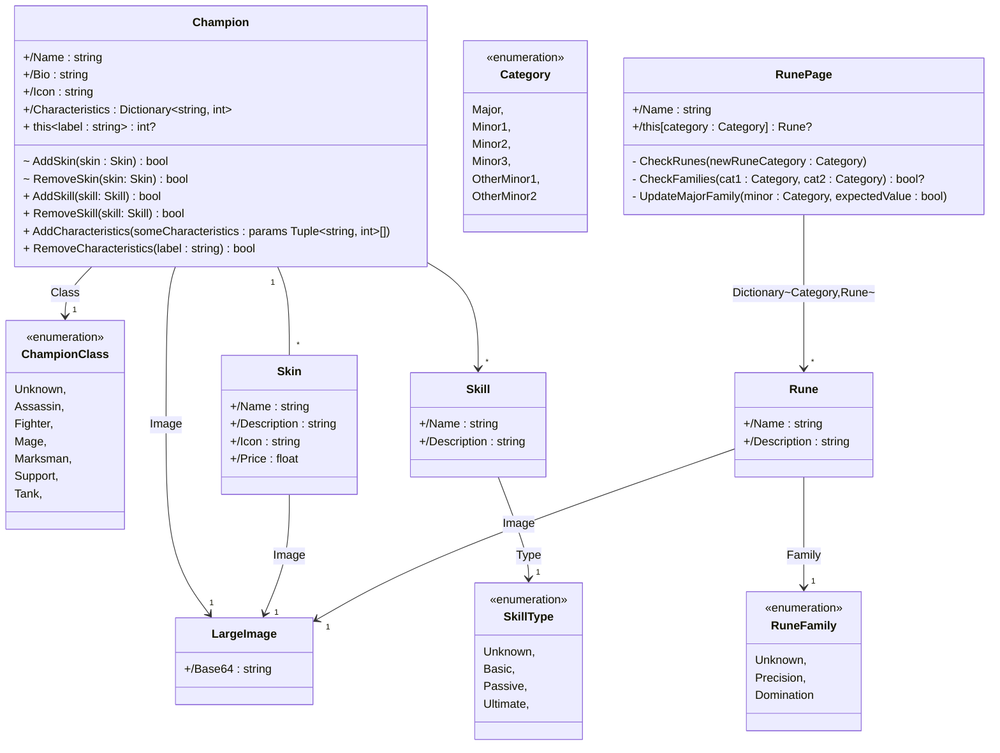
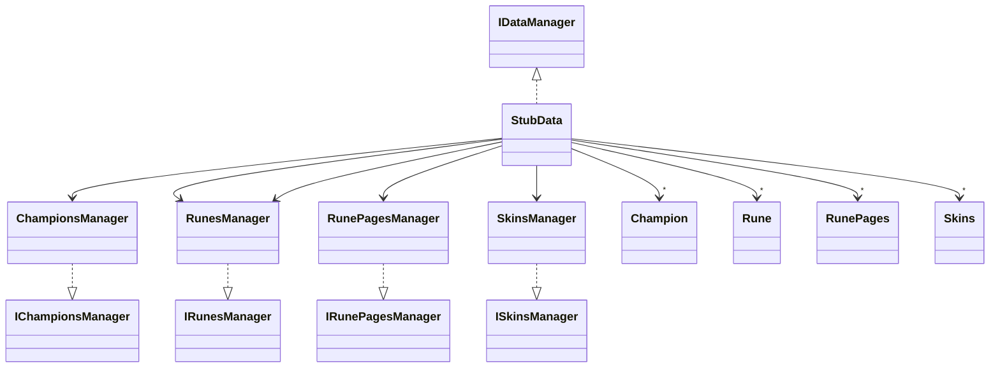

# Software architecture (R4.01)
__Author:__ Franco Nicolas           
__Group:__ PM2    
__Year:__ 2A BUT      

This project was developed as part of the "__R4.01 Software Architecture__" course  taught by Mr. Chevaldonne, Ms. Millet, and Mr. Raymmond. This README file contains some documentation referring to my understanding of the project and what was done.

Table of contents :page_with_curl:
=================

<!--ts-->
   * [Installation and Running the solution](#installation)
   * [Project Structure](#structure)
      * [General Description](#general-description)
   * [Model, Business and Logic](#model)
   * [Database with Entity Framework](#database-with-entity-framework)
   * [Restful API](#restful-api)
   * [CI](#continuous-integration)
   * [Possible improvements](#possible-improvements)
   * [Conclusion](#conclusion)

<!--te-->

## Structure
 

### General Description
This project supports three different types of __clients__: <u>mobile</u>, <u>web</u>, and <u>desktop</u>. All of these clients communicate with a centralized __model__, which is responsible for handling <u>data</u> and <u>business</u> logic. 
Initially, the model uses fake data, as indicated by the green __Stub__ area. However, as the project progressed, the model was updated to use data from an API client. 
This client connects to a __Web API__, which serves as a bridge between the model and the data storage layer. The Web API interacts with an Entity Framework __(EF) database__, which is responsible for storing and managing data. In its early development, the API would also use fake data, hence the connection with the Stub. Both the model and the API interact with this database to retrieve and store data as needed. Additionally, the Web API is hosted on a __server__ [1], which allows clients to easily access it and interact with the model and data.
By using a central model and a Web API, we have designed a flexible architecture that can accommodate different types of clients and data storage systems.

[1]  _To be more precise, the Web API is deployed on a Docker container, the purpose of this representation is simply to convey the idea that the API is hosted on a separate system._

## Diagram Details
_[In this next section, I will try to detail the different connections you see in the diagram while giving some code snippets from the project's source to demonstrate how every bit was implemented.](#./Documentation/architecture_global_description.md)_  

_[Table of contents](#table-of-contents-📃)_

---

## Database

### Entity Framework: Why Use It
Entity Framework (EF) is an Object-Relational Mapper (ORM) that simplifies data access as developers can work with relational data using domain-specific objects. With EF we didn't have to write any explicit SQL to build the database or the query it.

### Mappers and Entities
__Entities__ are classes with no logic that represent database tables. They consist of properties that define the columns of the table and relationships with other entities. In our code we have the following `ChampionEntity`, `SkinEntity`, `SkillEntity`, `RunePage` and `RuneEntity`.

For each entity we also have __mappers__, classes that handle the conversion between domain models and entities. They offer a way to map the properties of a domain model to corresponding properties of an entity and vice versa, ensuring data consistency after it moves around from database to model etc.

### How This Database Was Built
 The `ChampDbContext` class, derived from DbContext, is the main connection point between EF and the database. It contains `DbSet` properties (Champions, Skins, Skills, Runes, and RunePages) that represent the different tables in the database.

The `OnModelCreating` method in `ChampDbContext` sets up the relationships between the entities and configures the behavior of the database.

### Different Relationships Implemented
With this model, we had to implement two types of relationships in the database:

__One-to-many__: One `ChampionEntity` is related to multiple SkinEntity objects. This relationship is configured using the `HasOne` and `WithMany` methods in `OnModelCreating`.

__Many-to-many__: The `ChampionEntity` and `SkillEntity` classes have a many-to-many relationship, meaning each champion has multiple skills and each skill has multiple champions. A similar relationship exists between `RuneEntity` and `RunePageEntity`, as well as `ChampionEntity` and `RunePageEntity` (__many-to-many-to-many__). These relationships are configured using the `HasMany` and `WithMany` methods in `OnModelCreating`.

### Why I used Fluent API Instead of Data Annotations or Naming Conventions
Frst I tried using naming convention but finally fluent API seemed to be the most practical one, as well as my professor's recommendation.

Using Fluent API keeps the configuration separate from the entity classes, which keeps the entity classes cleaner. Also the configuration is centralized on the OnModelCreating method which made it easier to manage and modify the database configuration.

### Constantly Using Migrations and Recreating Them
Throughout the development process, migrations were used to keep the database schema up to date with changes in the code. Whenever a new table was added or a significant change was made to the database, the previous migration was deleted and a new one was recreated to ensure that the database schema stayed in sync with the latest code changes.

_[Table of contents](#table-of-contents-📃)_

---

## Restful API

_[Table of contents](#table-of-contents-📃)_

---

## CI

_[Table of contents](#table-of-contents-📃)_

---

## Possible improvements

## Model
In order to better understand the code and architecture of the application, we will now take a closer look at the structure of the model, including its classes and interfaces. __It is important to note that the model was developed by our professor, Mr. Chevaldonne__.

#### Class Diagram

Thid model provides a representation to different elements of the game [League of Legends](https://www.leagueoflegends.com/fr-fr/).

#### Data Access Management Interfaces Diagram
The `IGenericDataManager<T>` interface provides methods for _getting_, _updating_, _adding_, and _deleting_ items of type T. The `IChampionsManager`, `IRunesManager`, `IRunePagesManager`, and `ISkinsManager` interfaces add category-specific methods for filtering and sorting the data.

#### Simplified Stub Class Diagram
Here the `ChampionsManager`, `RunesManager`, `RunePagesManager`, and `SkinsManager` classes implement their respective _manager interfaces_ and are responsible for calling the appropriate methods on the `StubData` object to manipulate the data.

_[Table of contents](#table-of-contents-📃)_

---

## Conslusion

_[Table of contents](#table-of-contents-📃)_

---