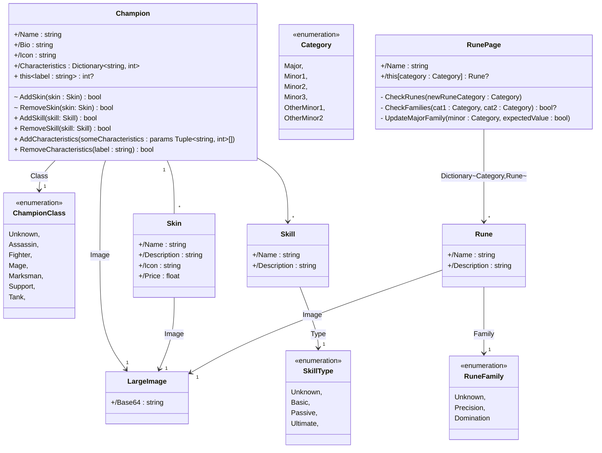
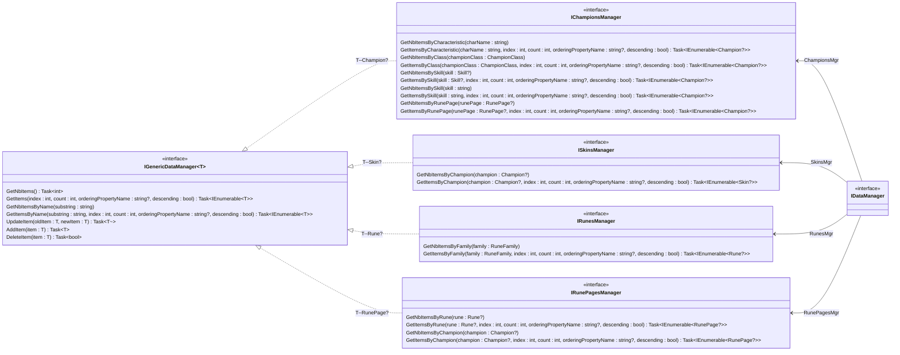
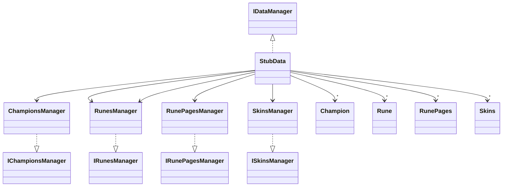

# prepaLoL

## Diagramme de classes du modèle

```mermaid
classDiagram
class LargeImage{
    +/Base64 : string
}
class Champion{
    +/Name : string
    +/Bio : string
    +/Icon : string
    +/Characteristics : Dictionary~string, int~
    ~ AddSkin(skin : Skin) bool
    ~ RemoveSkin(skin: Skin) bool
    + AddSkill(skill: Skill) bool
    + RemoveSkill(skill: Skill) bool
    + AddCharacteristics(someCharacteristics : params Tuple~string, int~[])
    + RemoveCharacteristics(label : string) bool
    + this~label : string~ : int?
}
Champion --> "1" LargeImage : Image
class ChampionClass{
    <<enumeration>>
    Unknown,
    Assassin,
    Fighter,
    Mage,
    Marksman,
    Support,
    Tank,
}
Champion --> "1" ChampionClass : Class
class Skin{
    +/Name : string    
    +/Description : string
    +/Icon : string
    +/Price : float
}
Skin --> "1" LargeImage : Image
Champion "1" -- "*" Skin 
class Skill{
    +/Name : string    
    +/Description : string
}
class SkillType{
    <<enumeration>>
    Unknown,
    Basic,
    Passive,
    Ultimate,
}
Skill --> "1" SkillType : Type
Champion --> "*" Skill
class Rune{
    +/Name : string    
    +/Description : string
}
Rune --> "1" LargeImage : Image
class RuneFamily{
    <<enumeration>>
    Unknown,
    Precision,
    Domination
}
Rune --> "1" RuneFamily : Family
class Category{
    <<enumeration>>
    Major,
    Minor1,
    Minor2,
    Minor3,
    OtherMinor1,
    OtherMinor2
}
class RunePage{
    +/Name : string
    +/this[category : Category] : Rune?
    - CheckRunes(newRuneCategory : Category)
    - CheckFamilies(cat1 : Category, cat2 : Category) bool?
    - UpdateMajorFamily(minor : Category, expectedValue : bool)
}
RunePage --> "*" Rune : Dictionary~Category,Rune~
```

## Diagramme de classes des interfaces de gestion de l'accès aux données

```mermaid
classDiagram
direction LR;
class IGenericDataManager~T~{
    <<interface>>
    GetNbItems() Task~int~
    GetItems(index : int, count : int, orderingPropertyName : string?, descending : bool) Task~IEnumerable~T~~
    GetNbItemsByName(substring : string)
    GetItemsByName(substring : string, index : int, count : int, orderingPropertyName : string?, descending : bool) Task~IEnumerable~T~~
    UpdateItem(oldItem : T, newItem : T) Task~T~~
    AddItem(item : T) Task~T~
    DeleteItem(item : T) Task~bool~
}
class IChampionsManager{
    <<interface>>
    GetNbItemsByCharacteristic(charName : string)
    GetItemsByCharacteristic(charName : string, index : int, count : int, orderingPropertyName : string?, descending : bool) Task~IEnumerable~Champion?~~
    GetNbItemsByClass(championClass : ChampionClass)
    GetItemsByClass(championClass : ChampionClass, index : int, count : int, orderingPropertyName : string?, descending : bool) Task~IEnumerable~Champion?~~
    GetNbItemsBySkill(skill : Skill?)
    GetItemsBySkill(skill : Skill?, index : int, count : int, orderingPropertyName : string?, descending : bool) Task~IEnumerable~Champion?~~
    GetNbItemsBySkill(skill : string)
    GetItemsBySkill(skill : string, index : int, count : int, orderingPropertyName : string?, descending : bool) Task~IEnumerable~Champion?~~
    GetNbItemsByRunePage(runePage : RunePage?)
    GetItemsByRunePage(runePage : RunePage?, index : int, count : int, orderingPropertyName : string?, descending : bool) Task~IEnumerable~Champion?~~
}
class ISkinsManager{
    <<interface>>
    GetNbItemsByChampion(champion : Champion?)
    GetItemsByChampion(champion : Champion?, index : int, count : int, orderingPropertyName : string?, descending : bool) Task~IEnumerable~Skin?~~
}
class IRunesManager{
    <<interface>>
    GetNbItemsByFamily(family : RuneFamily)
    GetItemsByFamily(family : RuneFamily, index : int, count : int, orderingPropertyName : string?, descending : bool) Task~IEnumerable~Rune?~~
}
class IRunePagesManager{
    <<interface>>
    GetNbItemsByRune(rune : Rune?)
    GetItemsByRune(rune : Rune?, index : int, count : int, orderingPropertyName : string?, descending : bool) Task~IEnumerable~RunePage?~~
    GetNbItemsByChampion(champion : Champion?)
    GetItemsByChampion(champion : Champion?, index : int, count : int, orderingPropertyName : string?, descending : bool) Task~IEnumerable~RunePage?~~
}

IGenericDataManager~Champion?~ <|.. IChampionsManager : T--Champion?
IGenericDataManager~Skin?~ <|.. ISkinsManager : T--Skin?
IGenericDataManager~Rune?~ <|.. IRunesManager : T--Rune?
IGenericDataManager~RunePage?~ <|.. IRunePagesManager : T--RunePage?
class IDataManager{
    <<interface>>
}
IChampionsManager <-- IDataManager : ChampionsMgr
ISkinsManager <-- IDataManager : SkinsMgr
IRunesManager <-- IDataManager : RunesMgr
IRunePagesManager <-- IDataManager : RunePagesMgr
```

## Diagramme de classes simplifié du Stub

```mermaid
classDiagram
direction TB;

IDataManager <|.. StubData

ChampionsManager ..|> IChampionsManager
StubData --> ChampionsManager

RunesManager ..|> IRunesManager
StubData --> RunesManager

RunePagesManager ..|> IRunePagesManager
StubData --> RunePagesManager

SkinsManager ..|> ISkinsManager
StubData --> SkinsManager

StubData --> RunesManager
StubData --> "*" Champion
StubData --> "*" Rune
StubData --> "*" RunePages
StubData --> "*" Skins
```