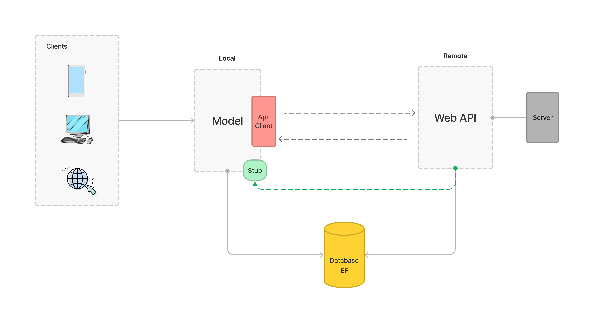

# Software architecture (R4.01)
__Author:__ Franco Nicolas           
__Group:__ PM2    
__Year:__ 2A BUT      

This project was developed as part of the "__R4.01 Software Architecture__" course  taught by Mr. Chevaldonne, Ms. Millet, and Mr. Raymmond. This README file contains some documentation referring to my understanding of the project and what was done.

Table of contents :page_with_curl:
=================

<!--ts-->
   * [Installation and Running the solution](#installation)
   * [Project Structure](#structure)
      * [General Description](#general-description)
   * [Model, Business and Logic](#model)
   * [Database with Entity Framework](#database-with-entity-framework)
   * [Restful API](#restful-api)
   * [CI](#continuous-integration)
   * [Possible improvements](#possible-improvements)
   * [Conclusion](#conclusion)


<!--te-->

## Structure
 

### General Description
This project supports three different types of __clients__: <u>mobile</u>, <u>web</u>, and <u>desktop</u>. All of these clients communicate with a centralized __model__, which is responsible for handling <u>data</u> and <u>business</u> logic. 
Initially, the model uses fake data, as indicated by the green __Stub__ area. However, as the project progressed, the model was updated to use data from an API client. 
This client connects to a __Web API__, which serves as a bridge between the model and the data storage layer. The Web API interacts with an Entity Framework __(EF) database__, which is responsible for storing and managing data. In its early development, the API would also use fake data, hence the connection with the Stub. Both the model and the API interact with this database to retrieve and store data as needed. Additionally, the Web API is hosted on a __server__ [1], which allows clients to easily access it and interact with the model and data.
By using a central model and a Web API, we have designed a flexible architecture that can accommodate different types of clients and data storage systems.

[1]  _To be more precise, the Web API is deployed on a Docker container, the purpose of this representation is simply to convey the idea that the API is hosted on a separate system._


### Client-Model Communication
Let's take a more technical look at how the client and the model communicate. I invite you to first read about the [model](#model) and how it is structured to better understand this part.  

The client communicates with the model through an instance of the `IDataManager` class. Thanks to our abstraction layer with the `IDataManager`, everything is easily accessible and all layers are _interchangeable_. 

#### Code Snippet (Client-Model Communication)
As I previously explained, in the early stages of development, the Model used fake data provided by the Stub. The green Stub box in the diagram represents this data source. The Model has a reference to the Stub, which is indicated by a green arrow connecting the two elements. In terms of code, this happens at the `MauiProgram.cs` class:
> MauiPorgram.cs
```c#
public static class MauiProgram
{
	public static MauiApp CreateMauiApp()
	{
		var builder = MauiApp.CreateBuilder();
		builder
			.UseMauiApp<App>()
			.UseMauiCommunityToolkit()
			.ConfigureFonts(fonts =>
			{
				fonts.AddFont("OpenSans-Regular.ttf", "OpenSansRegular");
				fonts.AddFont("OpenSans-Semibold.ttf", "OpenSansSemibold");
				fonts.AddFont("Font Awesome 6 Free-Solid-900.otf", "FASolid");
			});
		builder.Services.AddSingleton<IDataManager, StubData>()
						.AddSingleton<ChampionsMgrVM>()
						.AddSingleton<SkinsMgrVM>()
						.AddSingleton<ApplicationVM>()
						.AddSingleton<ChampionsPage>();

#if DEBUG
		builder.Logging.AddDebug();
#endif

		return builder.Build();
	}
}
```

* As you can see, we are declaring a dependency injection for the IDataManager interface to use the `StubData` as its implementation: `builder.Services.AddSingleton<IDataManager, StubData>()`. The `AddSingleton` method is used to say that we will have a singleton instance of the `IDataManager` (which is ideal here).
* As the project progressed and we wanted to use real data in our app, we simply had to update this line of code, replacing `StubData` with `EfData` (detailed [here](#efdata)), the new interface we've implemented that _directly consumes our Entity Framework database:_

```
builder.Services.AddSingleton<IDataManager, EfData>()
```

