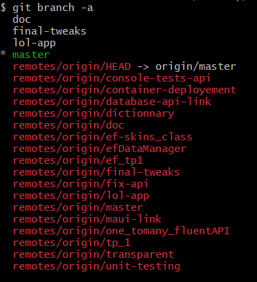

# Software architecture (R4.01)
__Author:__ Franco Nicolas           
__Group:__ PM2    
__Year:__ 2A BUT      

This project was developed as part of the "__R4.01 Software Architecture__" course  taught by Mr. Chevaldonne, Ms. Millet, and Mr. Raymmond. This README file contains some documentation referring to my understanding of the project and what was done.

Table of contents :page_with_curl:
=================

<!--ts-->
   * [Introduction](#introduction)
   * [Installation and Running the solution](#installation)
   * [Project Structure](#structure-building_construction)
      * [General Description](#general-description)
      * [Detailed Description](#diagram-details-mag)
   * [Database with Entity Framework](#database-minidisc)
   * [Restful API](#restful-api-globe_with_meridians)
   * [Tests](#tests-test_tube)
   * [CI](#ci-infinity)
   * [Model, Business and Logic](#model-file_folder)


### List of doings / couldn't do

- Api
    - [x] ChampionsController
    - [x] ChampionControllerTest
    - [x] Use of Loggers
    - [x] Pagination
    - [x] GET api/\<Champion\>/Akali/skin
    - [ ] Other controllers

- EF
    - [x] Entities
    - [x] Mappers
    - [x] One-to-Many
    - [x] Many-to-Many (to-Many)
    - [x] Fact tests
    - [x] Theory + InlineData tests
    - [x] Theory + DataMember tests
    - [x] SqliteInMemory
    - [ ] Dictionary

- Other
    - [x] CI with sonar
    - [x] README
    - [x] Documentation 
    - [x] Detailed architecture diagram description
    - [ ] MAUI link with EF or API


<!--te-->

## Introduction
Throughout this project, I worked independently to maximize my learning. By working alone, I was able to ensure that I thoroughly understood every aspect of the project, rather than skipping over certain parts. To keep the master branch clean, I created separate branches for each feature I worked on, and merged most of them through the command line. However, a couple of branches were explicitly merged using the merge request feature in Gitea, as it was part of the project's requirement. You can find a complete history of all the branches in the image below.



To make it easy to understand the project's evolution, I made sure to write clear and explicit commit messages. This also helped me revisit specific points of the project when necessary.

While I haven't provided full documentation for every class in every file, I did leave several comments throughout the code to help clarify certain aspects and for personnal use (mostly to remeber things between classes). In this README, I have made a concerted effort to provide detailed documentation explaining how each part of the project was implemented and my choices.

## Installation

### Prerequisites
Before installing the project, make sure you have the following installed:

* .NET 6.0 SDK
* Docker (for running the Web API on a separate container)

### Installing 
1. Cloning repository
```
git clone https://codefirst.iut.uca.fr/git/nicolas.franco/Projet_EntityFramework.git
```

2. Open the project solution file and restore the NuGet packages by running the following command:
```
dotnet restore
```
 
3. Build the solution by running the following command :
```
dotnet build
```

### Setup the web API

4. You can setup the web api using __docker__, with the following:
```
docker pull codefirst.iut.uca.fr/nicolas.franco/projet_entityframework:latest
docker run -d -p 8080:80 --name mywebapi_container codefirst.iut.uca.fr/nicolas.franco/projet_entityframework:latest
```

5. Run the project:
```
dotnet run --project LolApp
```

> :warning: **Current version of the master branch doesn't include the LolApp project since I couldn't make it work in time. You most likely won't be able to run the solution by following these steps :construction:**
```
dotnet run --project Api
```

## Structure :building_construction:
 

### General Description
This project supports three different types of __clients__: <u>mobile</u>, <u>web</u>, and <u>desktop</u>. All of these clients communicate with a centralized __model__, which is responsible for handling <u>data</u> and <u>business</u> logic. 
Initially, the model uses fake data, as indicated by the green __Stub__ area. However, as the project progressed, the model was updated to use data from an API client. 
This client connects to a __Web API__, which serves as a bridge between the model and the data storage layer. The Web API interacts with an Entity Framework __(EF) database__, which is responsible for storing and managing data. In its early development, the API would also use fake data, hence the connection with the Stub. Both the model and the API interact with this database to retrieve and store data as needed. Additionally, the Web API is hosted on a __server__ [1], which allows clients to easily access it and interact with the model and data.
By using a central model and a Web API, we have designed a flexible architecture that can accommodate different types of clients and data storage systems.

[1]  _To be more precise, the Web API is deployed on a Docker container, the purpose of this representation is simply to convey the idea that the API is hosted on a separate system._

## Diagram Details :mag:
_In this next section, I will try to detail the different connections you see in the diagram while giving some code snippets from the project's source to demonstrate how every bit was implemented.)_


# Description of the software's global architecture

### Client-Model Communication 

Let's take a more technical look at how the client and the model communicate. I invite you to first read about the [model](#model) and how it is structured to better understand this part.  
The client communicates with the model through an instance of the `IDataManager` class. Thanks to our abstraction layer with the `IDataManager`, everything is easily accessible and all layers are _interchangeable_. 


As I previously explained, in the early stages of development, the Model used fake data provided by the Stub. The green Stub box in the diagram represents this data source. The Model has a reference to the Stub, which is indicated by a green arrow connecting the two elements. In terms of code, this happens at the `MauiProgram.cs` class:

> MauiPorgram.cs
```c#
public static class MauiProgram
{
	public static MauiApp CreateMauiApp()
	{
		var builder = MauiApp.CreateBuilder();
		builder
			.UseMauiApp<App>()
			.UseMauiCommunityToolkit()
			.ConfigureFonts(fonts =>
			{
				fonts.AddFont("OpenSans-Regular.ttf", "OpenSansRegular");
				fonts.AddFont("OpenSans-Semibold.ttf", "OpenSansSemibold");
				fonts.AddFont("Font Awesome 6 Free-Solid-900.otf", "FASolid");
			});
		builder.Services.AddSingleton<IDataManager, StubData>()
						.AddSingleton<ChampionsMgrVM>()
						.AddSingleton<SkinsMgrVM>()
						.AddSingleton<ApplicationVM>()
						.AddSingleton<ChampionsPage>();

#if DEBUG
		builder.Logging.AddDebug();
#endif

		return builder.Build();
	}
}
```

* As you can see, we are declaring a _dependecy injection_ for the IDataManager interface to use the `StubData` as its implementation: `builder.Services.AddSingleton<IDataManager, StubData>()`. The `AddSingleton` method is used to say that we will have a singleton instance of the `IDataManager` (which is ideal here).

* As the project progressed and we wanted to use real data in our app, we simply had to update this line of code, replacing `StubData` with `EfData` (detailed [here](#efdata)), the new interface we've implemented that _directly consumes our [Entity Framework database](#database-with-entity-framework):_

```
builder.Services.AddSingleton<IDataManager, EfData>()
```
### Model's API Client and Web API
Instead of directly consuming our database, using `EfData`, the client can also chose to query the data from [our API](#restful-api) (represented by the double-sided arrow in the diagram). To enable this, we will use yet another interface implmenting `IDataManager`, which is the red box you see attached to the model on the diagram, the `HttpManager` class.

> HttpManager.cs
```c# 
public partial class HttpManager : IDataManager
{
   public HttpManager(HttpClient httpClient)
   {
      HttpClient = httpClient;
      ChampionsMgr = new ChampionMgr(this);
   }

   public IChampionsManager ChampionsMgr { get; }

   public ISkinsManager SkinsMgr { get; }

   public IRunesManager RunesMgr { get; }

   public IRunePagesManager RunePagesMgr { get; }

   protected HttpClient HttpClient { get; set; }
}
```

To better understand how this class is used for the model to communicate with the API, we can look at the two methods we use in the partial class `ChampionsMgr`:

> HttpManager.Champion.cs
```c#
public partial class HttpManager
{
   public class ChampionMgr : IChampionsManager
   {
      private readonly HttpManager parent;
      public ChampionMgr(HttpManager parent)
            => this.parent = parent;

      // GET
      public async Task<IEnumerable<Champion?>> GetItems(int index, int count, string? orderingPropertyName = null, bool descending = false)
      {
         var response = await parent.HttpClient.GetAsync($"api/Champions?index={index}&count={count}");
         if (!response.IsSuccessStatusCode)
         {
            throw new HttpRequestException($"Error while getting champions, status code: {response.StatusCode}");
         }
         var page = await response.Content.ReadFromJsonAsync<Page>();
         return page.MyChampions.Select(c => c.ToModel());
      }

      // GET by NAME
      public async Task<IEnumerable<Champion?>> GetItemsByName(string substring, int index, int count, string? orderingPropertyName = null, bool descending = false)
      {
         var response = await parent.HttpClient.GetAsync($"api/Champions/{substring}");
         if (!response.IsSuccessStatusCode)
         {
            throw new HttpRequestException($"Error while getting champion {substring}, status code: {response.StatusCode}");
         }
         var champion = await response.Content.ReadFromJsonAsync<Champion>();
         var champions = new List<Champion>
         {
            champion
         };
         return champions;
      }

      // Other methods ...
   }
}
```
In this particular case, the `HttpManager` class is used to manage champion data through the `ChampionMgr` class, which implements the `IChampionsManager` interface.

Through the `ChampionMgr` the client will be able to perform CRUD operations on champions data. For example, the `GetItems` method sends an HTTP GET request to the API to retrieve a list of champions, while the `GetItemsByName` method sends an HTTP GET request a specific champion.

The _parent parameter_ in each of these methods is an instance of the `HttpManager` class that is used to make the HTTP requests. The `HttpClient` attribute is used to create and send the requests.

The goal of this API client is to allow us to abstract away the details of the database so that, we can retrieve or manipulate data from the API without needing to understand the underlying database or infrastructure.

_You'll find more details about this API's structure [here](#restful-api)._

### API and Database
To clarify, the data that is requested through the API is __also__ retrieved from our Entity Framework (EF) database. This is why the diagram shows a connection between the __Web API__ and the __EF Database__.

In our program, each controller in the API has an `IDataManager` attribute. This allows us to access a single instance of the `IDataManager` that we define in our __Program.cs__ file, similarly to what we did on the __MauiProgram.cs__. Here is an example with the `Get` method from the `ChampionsController` class:

> ChampionsController.cs
```c#
[Route("api/[controller]")]
[ApiController]
public class ChampionsController : ControllerBase
{
   public IDataManager dataManager;

   private readonly ILogger<ChampionsController> _logger;

   public ChampionsController(IDataManager d, ILogger<ChampionsController> log)
   {
      dataManager = d;
      _logger = log;
   }

   // GET: api/<Champion>
   [HttpGet]
   public async Task<IActionResult> Get([FromQuery]PageRequest pageRequest)
   {
      // Logger ...
      
      try
      {
         var champions = (await dataManager.ChampionsMgr.GetItems(pageRequest.Index,
            pageRequest.Count)).Select(champion => champion?.ToDto());

         var page = new Page()
         {
            MyChampions = champions,
            Index = pageRequest.Index,
            Count = pageRequest.Count,
            TotalCount = await dataManager.ChampionsMgr.GetNbItems()
         };
         return Ok(page);
      }
      // catch ...
   }
   // Other methods ...
}
```

Here you can see the `IDataManager` class beeing used to fetch the list of champions : 
```
var champions = (await dataManager.ChampionsMgr.GetItems(pageRequest.Index,
            pageRequest.Count)).Select(champion => champion?.ToDto());
```

And just like with the __MauiProgram.cs__, we can modify the implementation type of `IDataManager` with _dependecy injection_ through the __Program.cs__ file:

> Program.cs
```c#
var builder = WebApplication.CreateBuilder(args);

// ...

/* Dependecy injection */
builder.Services.AddScoped<IDataManager, EfData>();

// ...

app.Run();
```

In the beginning of the project, when we still had no real data, we used the stub:

```
builder.Services.AddScoped<IDataManager, StubData>();
```

</br>

---
_End of detailed description._
_[Table of contents](#table-of-contents-page_with_curl)_

---

## Database :minidisc:

### Entity Framework: Why Use It
Entity Framework (EF) is an Object-Relational Mapper (ORM) that simplifies data access as developers can work with relational data using domain-specific objects. With EF we didn't have to write any explicit SQL to build the database or the query it.

### Mappers and Entities
__Entities__ are classes with no logic that represent database tables. They consist of properties that define the columns of the table and relationships with other entities. In our code we have the following `ChampionEntity`, `SkinEntity`, `SkillEntity`, `RunePage` and `RuneEntity`.

For each entity we also have __mappers__, classes that handle the conversion between domain models and entities. They offer a way to map the properties of a domain model to corresponding properties of an entity and vice versa, ensuring data consistency after it moves around from database to model etc.

### How This Database Was Built
 The `ChampDbContext` class, derived from DbContext, is the main connection point between EF and the database. It contains `DbSet` properties (Champions, Skins, Skills, Runes, and RunePages) that represent the different tables in the database.

The `OnModelCreating` method in `ChampDbContext` sets up the relationships between the entities and configures the behavior of the database.

### Different Relationships Implemented
With this model, we had to implement two types of relationships in the database:

__One-to-many__: One `ChampionEntity` is related to multiple SkinEntity objects. This relationship is configured using the `HasOne` and `WithMany` methods in `OnModelCreating`.

__Many-to-many__: The `ChampionEntity` and `SkillEntity` classes have a many-to-many relationship, meaning each champion has multiple skills and each skill has multiple champions. A similar relationship exists between `RuneEntity` and `RunePageEntity`, as well as `ChampionEntity` and `RunePageEntity` (__many-to-many-to-many__). These relationships are configured using the `HasMany` and `WithMany` methods in `OnModelCreating`.

### Why I used Fluent API Instead of Data Annotations or Naming Conventions
Frst I tried using naming convention but finally fluent API seemed to be the most practical one, as well as my professor's recommendation.

Using Fluent API keeps the configuration separate from the entity classes, which keeps the entity classes cleaner. Also the configuration is centralized on the OnModelCreating method which made it easier to manage and modify the database configuration.

### Constantly Using Migrations and Recreating Them
Throughout the development process, migrations were used to keep the database schema up to date with changes in the code. Whenever a new table was added or a significant change was made to the database, the previous migration was deleted and a new one was recreated to ensure that the database schema stayed in sync with the latest code changes.

_[Table of contents](#table-of-contents-page_with_curl)_

---

## Restful API :globe_with_meridians:

### RESTful API: Why use it?
A RESTful API is used to manipulate data through well known __HTTP requests__ such as  GET, PUT, POST, and DELETE. It follows a set of constraints or principles that make it scalable, flexible, and easy to maintain. REST is an acronym for Representational State Transfer, which means that the data is transferred in a _stateless_ manner between the __client__ and the __server__.

We used a RESTful API because they provided a standard way of accessing data and allow multiple clients (which is the case as we've seen here), to access the same data without having to know the underlying implementation details. 

### Implementation of the API and why Swagger was used
Our Web API was implemented using .NET 6.0 and the ASP.NET Core framework. We used Swagger to document the API because it provides a simple and easy-to-use interface.

### Routes and RESTfulness in the Champions Controller
For this project we would have idealy at least 5 controllers, for Champion, Skin, Rune, RunePage and Skill. However, due to time constraints and being solo, I've only implemented the Champion controller. I did my best to follow the RESTful principles, and we can imagine that the other controller would follow a very similar strucuture to what I did with the `ChampionsController` class. 

This controller provides several routes that allow clients to interact with the champion data. _The routes are designed to follow RESTful principles._

```
 GET __api/<Champion>__
```
* This route returns a list of champions. It accepts a `PageRequest` object as a query parameter, which allows clients to specify the page number and the number of champions to return per page. In the case of very large databases and high scale projects, this is almost essencial, here it was done as a learning process.

```
GET __api/<Champion>/Akali__  
```
* This route returns a specific champion by name. It takes the name as parameter.

```
POST api/<Champion>
```
* This route adds a new champion to the database. It takes a ChampionDto object in the request body.

```
PUT api/<Champion>/Akali
```
* This route updates an existing champion. It takes the champion's name as parameter and a ChampionDto object in the request body.

```
DELETE api/<Champion>/Akali
```
* This route deletes an existing champion. It accepts the champion's name as a URL parameter.

```
GET api/<Champion>/Akali/skins
```
* This route returns the skins of a specific champion. It takes the champion's name as parameter.

> __It is worth noticing that for the "uniqueness" of the champion, it's name was used, which in many cases might not be ideal, as we can imagine two objects having the same name. However, in order to keep the model unchanged, I chose to use the name attribute as a way to identify a specif champion for this project."__

### Loggers and Pagination
In the Champions Controller, I used loggers to keep track of requests and errors. I also used pagination as previously mentioned, to limit the number of champions returned per page which should improve the API's performance (in this example it might not make much difference). Here are some code snippets to illustrate how these features were implemented:
```c#
// Loggers
public ChampionsController(IDataManager d, ILogger<ChampionsController> log)
{
    dataManager = d;
    _logger = log;
}

// ...
_logger.LogInformation($"Request to get champions with index " +
        $"{pageRequest.Index} and count {pageRequest.Count}");

// ...
_logger.LogWarning("too many champions requested");

// ...
_logger.LogError(ex, "error while trying to get champions");
```
* I used different levels of warnings for their respective purposes.

```c#
// Pagination
public async Task<IActionResult> Get([FromQuery]PageRequest pageRequest)
{
    // ...
    var champions = (await dataManager.ChampionsMgr.GetItems(pageRequest.Index,
            pageRequest.Count)).Select(champion => champion?.ToDto());

    var page = new Page()
    {
        MyChampions = champions,
        Index = pageRequest.Index,
        Count = pageRequest.Count,
        TotalCount = await dataManager.ChampionsMgr.GetNbItems()
    };
    return Ok(page);
    // ...
}
```

### DTOs and why we used them
DTOs, or Data Transfer Objects, are objects that represent data in a format that can be easily transferred between different systems or layers of an application. In this cased, we used DTOs to represent champion data in a format that can be easily serialized and deserialized.

Here is an example of a ChampionDto class:
```
public class SkinDto
{
   public string? Name { get; set; }

   public string? Image { get; set; }

   public float? Price { get; set; }

   public string? Description { get; set; }

   public string? Icon { get; set; }

   public string? Champion { get; set; }

}
```
* As you can see the attributes are all strings, easy to serialize/deserialize

</br>

_[Table of contents](#table-of-contents-page_with_curl)_

---

## Tests :test_tube:
As I did this project by myself, in addition to time constraints, I wasn't able to achieve a perfect test coverage. However, I did my best to have the necessary tests for the implementation I did, as well as explore the different technologies we saw throughout the course.

### ApiController Unit Tests
For the ApiController, a unit test class was created, which includes test methods for all the API operations (all routes that I implemented). `ChampionControllerTest` class tests the Get, Post, Put, Delete, GetByName, and GetSkins methods. While the tests cover the essential functionality, __there is room for improvement__ in terms of testing edge cases and error handling.

### Database Tests
For database tests, I used __in-memory SQLite database__. This approach had several benefits:
* The tests run quickly, as there is no disk I/O.
* The tests are isolated, as the in-memory database is on RAM memory and does not interfere with other tests or the production database.
* It integrates well with Entity Framework, simplifying the setup and execution of tests.

### xUnit Test Types
As I mentioned previously, I tried different types of xUnit tests were employed  including:

* __Fact tests:__ These tests check basic functionality and do not require any input parameters.
* __Theory + InlineData:__ These tests allow parameterized testing, with input data provided directly within the test method.
* __Theory + DataMember:__ These tests also use parameterized testing, but the input data is separated from the test method and stored in a separate data member.

Each test type has its advantages and use cases. Fact tests are suitable for simple, straightforward tests. Theory tests with InlineData or DataMember are ideal for more complex tests that require various input parameters to validate different scenarios.

Overall, tests are currently limited to CRUD operations, it could be expanded to include additional scenarios and edge cases.

</br>

_[Table of contents](#table-of-contents-page_with_curl)_

---

## CI :infinity:
Continuous Integration (CI) is a development practice that allows each integration to be verified by an automated build and automated tests. CI aims to detect and fix integration issues as quickly as possible, improving software quality and reducing the time it takes to validate and release new updates.

### Drone and Sonar
In this project, we used Drone, an open-source container-native Continuous Integration and Continuous Delivery (CI/CD) platform, to automate our build, test, and deployment processes. Drone works with a simple YAML configuration file (.drone.yml) that defines the pipeline steps, you can find the one used for this project [here](.drone.yml).

Sonar is a code quality analysis tool that helps maintain code quality over time by providing insights into code issues like code smells. It can be integrated with the CI/CD pipeline.

### Pipeline Steps Overview

* Build: Restore, build, and publish the .NET project using the dotnet command.
* Tests: Run the .NET tests with code coverage.
* Code Analysis: Perform code analysis with SonarScanner, generate code coverage reports with ReportGenerator, and upload the results to SonarQube.
* Docker Image Build and Store: Build a Docker image using the provided Dockerfile, then push it to the project's container registry.
* Deploy Container: Deploy the Docker container to the production environment using the Codefirst Dockerproxy client.

</br>

_[Table of contents](#table-of-contents-page_with_curl)_

---

## Model :file_folder:
In order to better understand the code and architecture of the application, we will now take a closer look at the structure of the model, including its classes and interfaces. __It is important to note that the model was developed by our professor, Mr. Chevaldonne__.

### Class Diagram


Thid model provides a representation to different elements of the game [League of Legends](https://www.leagueoflegends.com/fr-fr/).

### Data Access Management Interfaces Diagram
The `IGenericDataManager<T>` interface provides methods for _getting_, _updating_, _adding_, and _deleting_ items of type T. The `IChampionsManager`, `IRunesManager`, `IRunePagesManager`, and `ISkinsManager` interfaces add category-specific methods for filtering and sorting the data.


### Simplified Stub Class Diagram
Here the `ChampionsManager`, `RunesManager`, `RunePagesManager`, and `SkinsManager` classes implement their respective _manager interfaces_ and are responsible for calling the appropriate methods on the `StubData` object to manipulate the data.


</br>

_[Table of contents](#table-of-contents-page_with_curl)_

---
